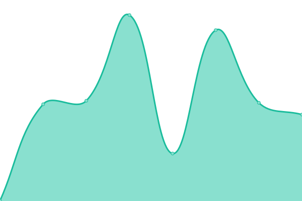
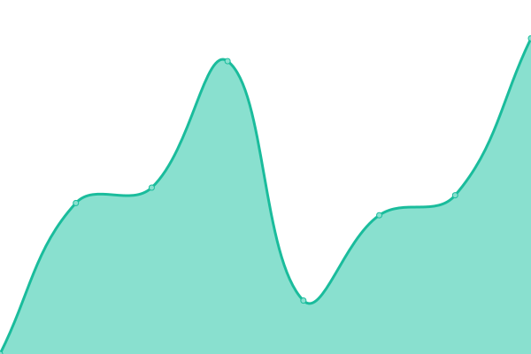
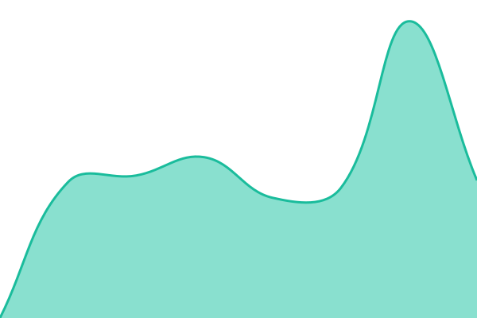

# [📈 Live Status](https://monitor.dmg.st): <!--live status--> **🟧 Partial outage**

This repository contains the open-source uptime monitor and status page for [Damrongsak Sattabut](https://dmg.st), powered by [Upptime](https://github.com/upptime/upptime).

With [Upptime](https://upptime.js.org), you can get your own unlimited and free uptime monitor and status page, powered entirely by a GitHub repository. We use [Issues](https://github.com/iLek2428/dmg-monitor/issues) as incident reports, [Actions](https://github.com/iLek2428/dmg-monitor/actions) as uptime monitors, and [Pages](https://monitor.dmg.st) for the status page.

<!--start: status pages-->
<!-- This summary is generated by Upptime (https://github.com/upptime/upptime) -->
<!-- Do not edit this manually, your changes will be overwritten -->
<!-- prettier-ignore -->
| URL | Status | History | Response Time | Uptime |
| --- | ------ | ------- | ------------- | ------ |
|  [Lannacom Academy](https://academy.lanna.co.th) | 🟩 Up | [lannacom-academy.yml](https://github.com/iLek2428/dmg-monitor/commits/HEAD/history/lannacom-academy.yml) | 

 420ms
     
 | 

<a href="https://monitor.dmg.st/history/lannacom-academy">100.00%</a>
    

|  [OBEC Academy](https://dlp.obec.go.th) | 🟥 Down | [obec-academy.yml](https://github.com/iLek2428/dmg-monitor/commits/HEAD/history/obec-academy.yml) | 

 0ms
     
 | 

<a href="https://monitor.dmg.st/history/obec-academy">0.00%</a>
    

|  [Beyond BU](https://beyond-mct.bu.ac.th) | 🟩 Up | [beyond-bu.yml](https://github.com/iLek2428/dmg-monitor/commits/HEAD/history/beyond-bu.yml) | 

 3994ms
     
 | 

<a href="https://monitor.dmg.st/history/beyond-bu">100.00%</a>
    

|  [RMUTI MOOC](https://mooc.rmuti.ac.th) | 🟩 Up | [rmuti-mooc.yml](https://github.com/iLek2428/dmg-monitor/commits/HEAD/history/rmuti-mooc.yml) | 

 3549ms
     
 | 

<a href="https://monitor.dmg.st/history/rmuti-mooc">100.00%</a>
    

|  [Google](https://www.google.com) | 🟩 Up | [google.yml](https://github.com/iLek2428/dmg-monitor/commits/HEAD/history/google.yml) | 

 82ms
     
 | 

<a href="https://monitor.dmg.st/history/google">100.00%</a>
    

|  [Wikipedia](https://en.wikipedia.org) | 🟩 Up | [wikipedia.yml](https://github.com/iLek2428/dmg-monitor/commits/HEAD/history/wikipedia.yml) | 

 194ms
     
 | 

<a href="https://monitor.dmg.st/history/wikipedia">100.00%</a>
    

<!--end: status pages-->

[**Visit our status website →**](https://monitor.dmg.st)

## 📄 License

- Powered by: [Upptime](https://github.com/upptime/upptime)
- Code: [MIT](./LICENSE) © [Damrongsak Sattabut](https://dmg.st)
- Data in the `./history` directory: [Open Database License](https://opendatacommons.org/licenses/odbl/1-0/)
